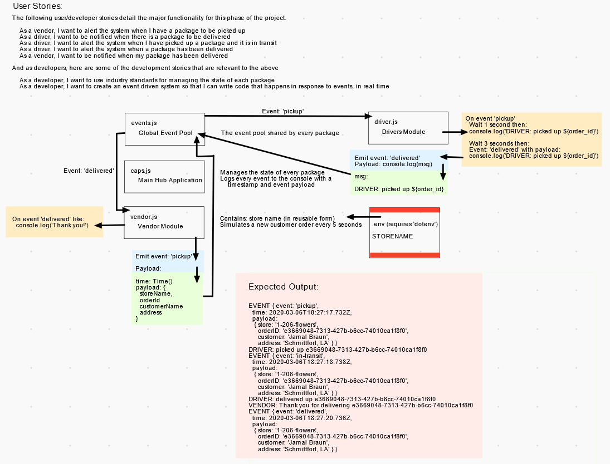

# LAB - Class 12

## Project: CAPS - Code Academy Parcel Service (with Socket.io)

### Author: Jeremy Penning

### Links and Resources

- [CI/CD](https://github.com/jeremyp-401-advanced-javascript/caps/actions) (GitHub Actions)

### Setup

#### `.env` requirements

- `STORE_NAME` - Name of the store using CAPS
- `HOST` - Host name (base URL) for this application
- `PORT` - The port used by socket.io

#### How to initialize/run the application

To run (in each application folder):

`npm start`

#### Tests

To run tests (inside the application folders):

`npm test`

### Sample Output (caps.js)

__Some output has been removed for clarity__


```javascript
Welcome to the CAPS namespace, BZbwA376b41NDRi4AAAB
Welcome to the CAPS namespace, wLhVbkNNk3kWpUFqAAAD
wLhVbkNNk3kWpUFqAAAD is joining Completely Adequate Products Inc.
EVENT {
  event: 'pickup',
  timestamp: 'Wed Dec 23 2020 15:10:28 GMT-0800 (Pacific Standard Time)',
  payload: {
    orderStore: 'Completely Adequate Products Inc.',
    orderId: 'b1cd09b2-ab92-4523-89da-7af4fe287008',
    orderCustomer: 'Angelo Wuckert DVM',
    orderAddress: '1159 Wiegand Dale Apt. 151, Deronhaven, IA 86430'
  }
}
EVENT {
  event: 'in-transit',
  timestamp: 'Wed Dec 23 2020 15:10:29 GMT-0800 (Pacific Standard Time)',
  payload: {
    orderStore: 'Completely Adequate Products Inc.',
    orderId: 'b1cd09b2-ab92-4523-89da-7af4fe287008',
    orderCustomer: 'Angelo Wuckert DVM',
    orderAddress: '1159 Wiegand Dale Apt. 151, Deronhaven, IA 86430'
  }
}
EVENT {
  event: 'delivered',
  timestamp: 'Wed Dec 23 2020 15:10:31 GMT-0800 (Pacific Standard Time)',
  payload: {
    orderStore: 'Completely Adequate Products Inc.',
    orderId: 'b1cd09b2-ab92-4523-89da-7af4fe287008',
    orderCustomer: 'Angelo Wuckert DVM',
    orderAddress: '1159 Wiegand Dale Apt. 151, Deronhaven, IA 86430'
  }
}


```

### Sample Output (vendor.js)

```
VENDOR: Thank you for delivering e4bd2287-13c1-4dfe-9340-b93fcdadb5aa
VENDOR: Thank you for delivering a86ebec3-6cc3-49e9-b1f8-815136d26a6c
VENDOR: Thank you for delivering 639b5d53-8388-4b70-bb64-a182cee41360
VENDOR: Thank you for delivering 83920c52-3bbf-4e7a-8938-5224bdb61167
VENDOR: Thank you for delivering c6ba1bd8-35c5-4875-bce4-dfa970fbfdec
VENDOR: Thank you for delivering a761beb3-008c-4b1f-87c4-07dbf3839193
VENDOR: Thank you for delivering ce288f2a-f23d-4d73-b19f-5e85ba025ee0
VENDOR: Thank you for delivering 7fe3c7e9-6af9-41c9-bf67-41343e6d07ae
VENDOR: Thank you for delivering a1bac20e-0909-43b0-b8e4-092a0e7663d9
VENDOR: Thank you for delivering eddd5821-9049-4402-930c-3ae6b8146723
VENDOR: Thank you for delivering 6c623280-f904-44ba-8955-f22dc3489b57

```

### Sample Output (driver.js)

```
Picking up e4bd2287-13c1-4dfe-9340-b93fcdadb5aa
Picking up a86ebec3-6cc3-49e9-b1f8-815136d26a6c
Picking up 639b5d53-8388-4b70-bb64-a182cee41360
Picking up 83920c52-3bbf-4e7a-8938-5224bdb61167
Delivering up e4bd2287-13c1-4dfe-9340-b93fcdadb5aa
Delivering up a86ebec3-6cc3-49e9-b1f8-815136d26a6c
Picking up c6ba1bd8-35c5-4875-bce4-dfa970fbfdec
Delivering up 639b5d53-8388-4b70-bb64-a182cee41360
Picking up a761beb3-008c-4b1f-87c4-07dbf3839193
Delivering up 83920c52-3bbf-4e7a-8938-5224bdb61167
Picking up ce288f2a-f23d-4d73-b19f-5e85ba025ee0
Delivering up c6ba1bd8-35c5-4875-bce4-dfa970fbfdec
```

### Whiteboard / UML

